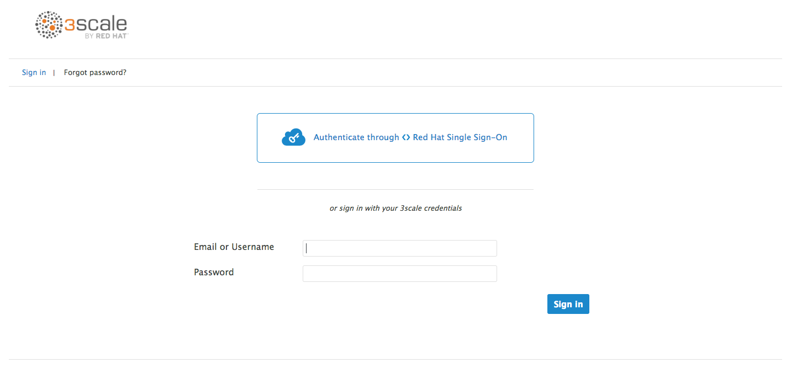
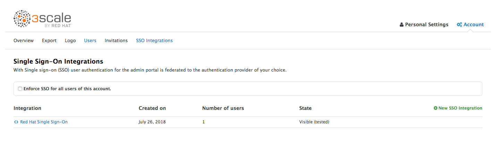
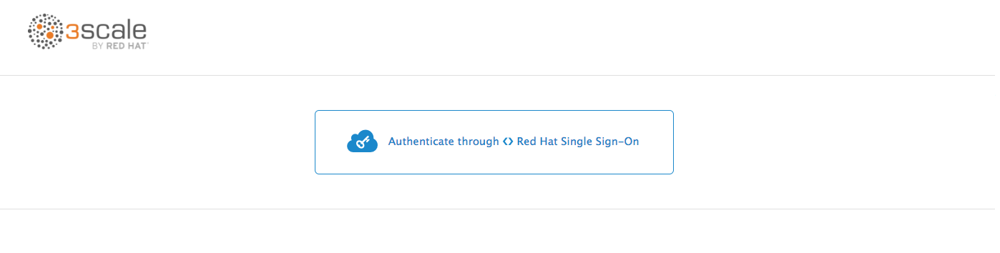

# Auth

* 3Scale ships with it's own authn/authz mechanism
* It can be configured to [use RHSSO/Keycloak](https://access.redhat.com/documentation/en-us/red_hat_3scale/2.2/html-single/developer_portal/#enabling_and_disabling_authentication_via_red_hat_single_sign_on)
* A ServiceAccount OAuthClient is *NOT* used by 3Scale

## Steps

* Ensure an RHSSO instance exists.

* Follow [the 3Scale SSO guide](https://access.redhat.com/documentation/en-us/red_hat_3scale/2.2/html-single/developer_portal/#enabling_and_disabling_authentication_via_red_hat_single_sign_on).

* You will be left with a hybrid SSO/standard auth login screen.

* To completely remove the standard login option, continue.

* Give one of the SSO users admin permissions (they must have logged in at least once to show up in the Users section).

* Select the option to enforce SSO for all users on the SSO Integrations page.

* Logout, there should be no standard login option, only SSO.

