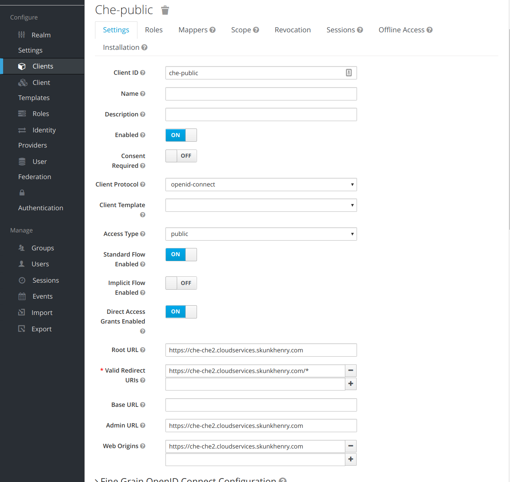

## Guide

* Template based Install https://www.eclipse.org/che/docs/openshift-multi-user.html#openshift-container-platform
* APB https://github.com/ansibleplaybookbundle/eclipse-che-apb

## Cluster Admin Requirements

If using the Che APB (instead of the template based install) the RoleBinding setup for the `che` ServiceAccount requires the ansible broker to have 'admin' sandbox role. See https://github.com/ansibleplaybookbundle/eclipse-che-apb#requirements
& https://github.com/eclipse/che/blob/master/deploy/openshift/templates/che-server-template.yaml#L19-L27

## Eclpise Che: Template based Install

### Install Che Server

Follow below steps based on the 'Deploy multi user Che with Postgres but connect to own Keycloak instance' guide here https://github.com/eclipse/che/tree/master/deploy/openshift/templates#deploy-multi-user-che-with-postgres-but-connect-to-own-keycloak-instance-https

```
git clone git@github.com:eclipse/che
cd deploy/openshift/templates

oc new-project che
oc new-app -f multi/postgres-template.yaml
oc apply -f pvc/che-server-pvc.yaml
oc new-app -f che-server-template.yaml -p ROUTING_SUFFIX=${ROUTING_SUFFIX} \
    -p CHE_MULTIUSER=true \
    -p CHE_KEYCLOAK_AUTH__SERVER__URL=https://secure-sso-sso.cloudservices.skunkhenry.com/auth/ \
    -p CHE_KEYCLOAK_REALM=openshift \
    -p CHE_KEYCLOAK_CLIENT_ID=che-public \
    -p PROTOCOL=https \
    -p WS_PROTOCOL=wss \
    -p TLS=true
oc set volume dc/che --add -m /data --name=che-data-volume --claim-name=che-data-volume
oc apply -f https
oc delete route keycloak
```

### Configure che-server with Self Signed Certificate

```
echo "" | openssl s_client -showcerts -connect cloudservices.skunkhenry.com:8443 -prexit 2>/dev/null | openssl x509 -outform PEM > ca.crt
CERTIFICATE=$(cat ./ca.crt)
oc new-app -f multi/openshift-certificate-secret.yaml -p CERTIFICATE="${CERTIFICATE}"
```

### Keycloak Client in **OpenShift's Keycloak**

* Create a new Keycloak client called `che-public`
* Set the `Valid Redirect URIs`, `Web Origins` etc.. to the Che Server route
* Verify other settings as per screenshot below


