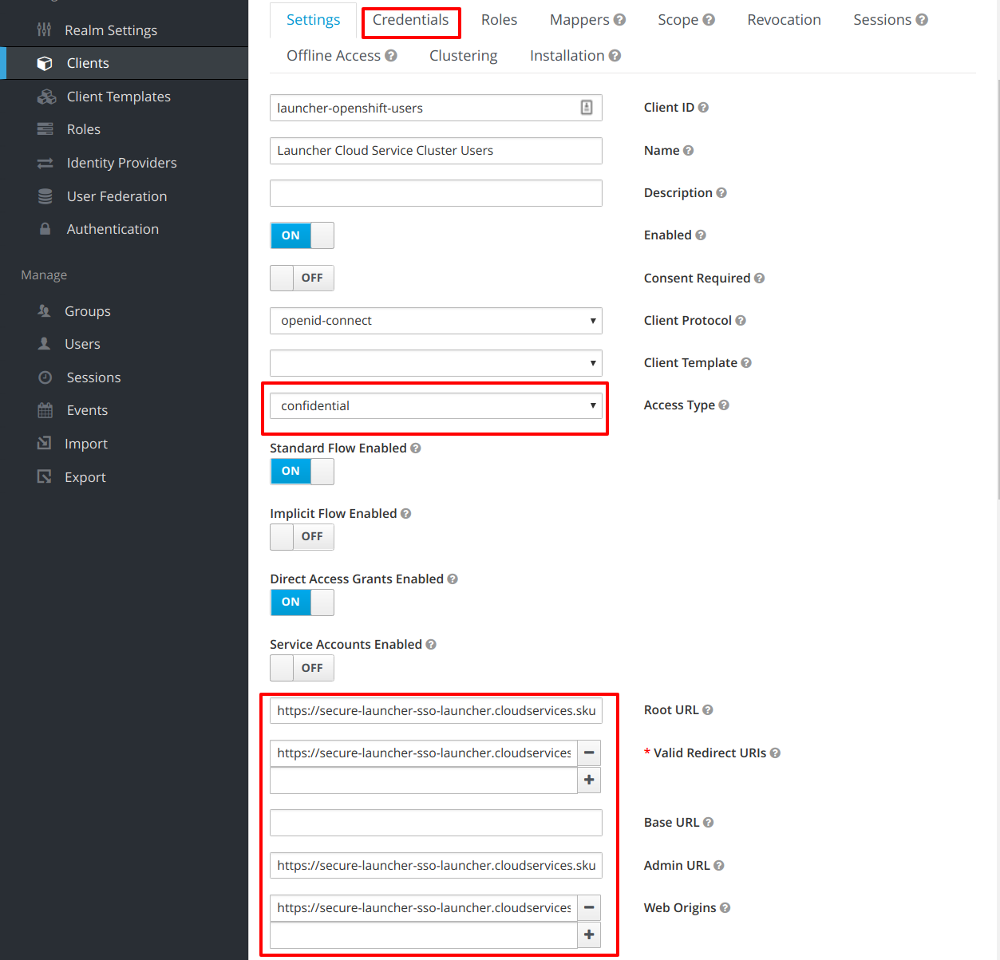
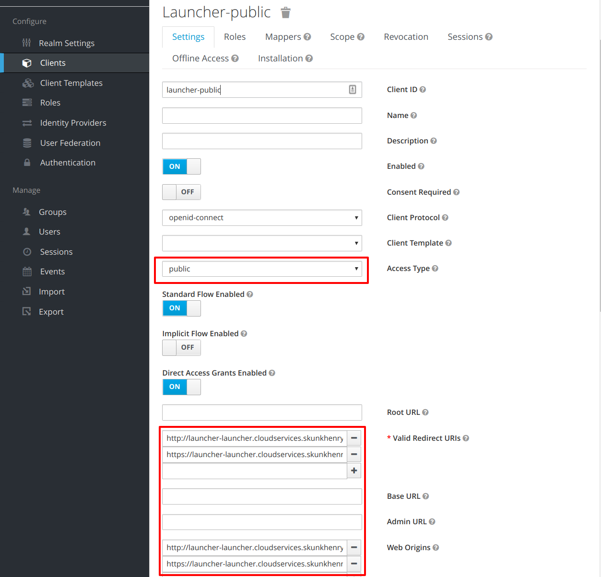
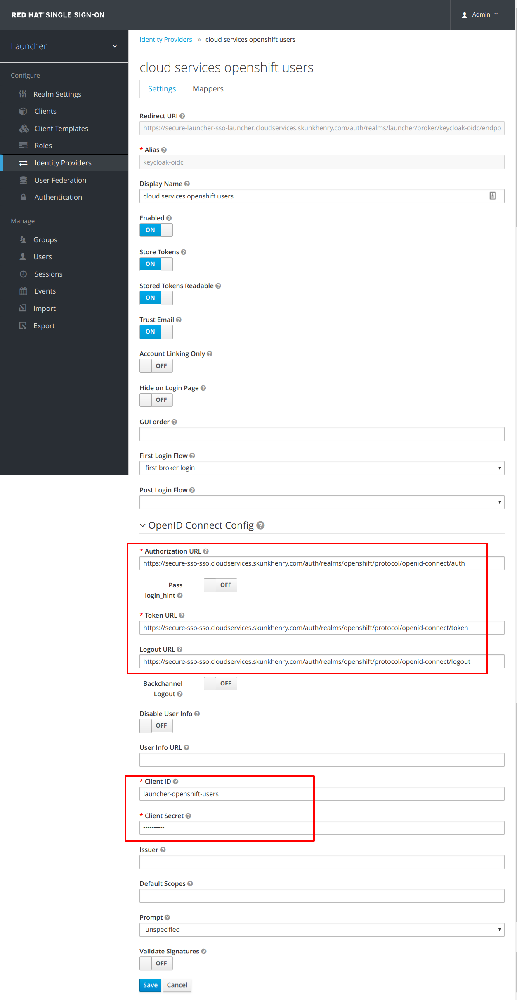
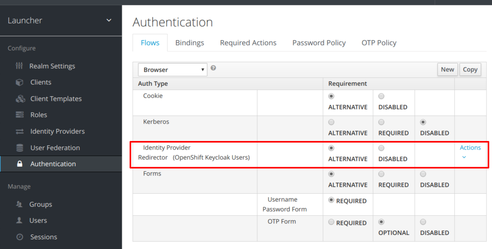
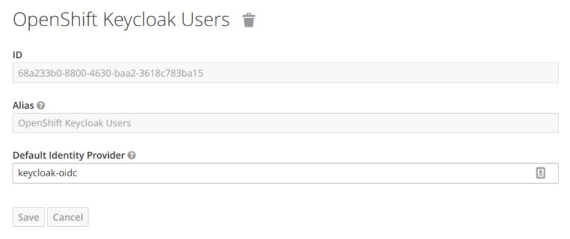
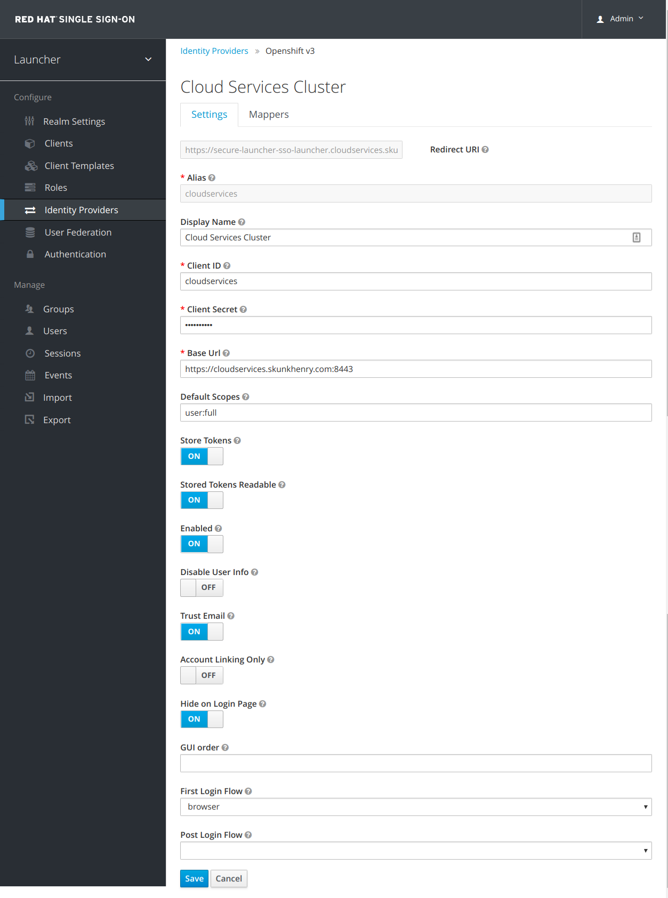
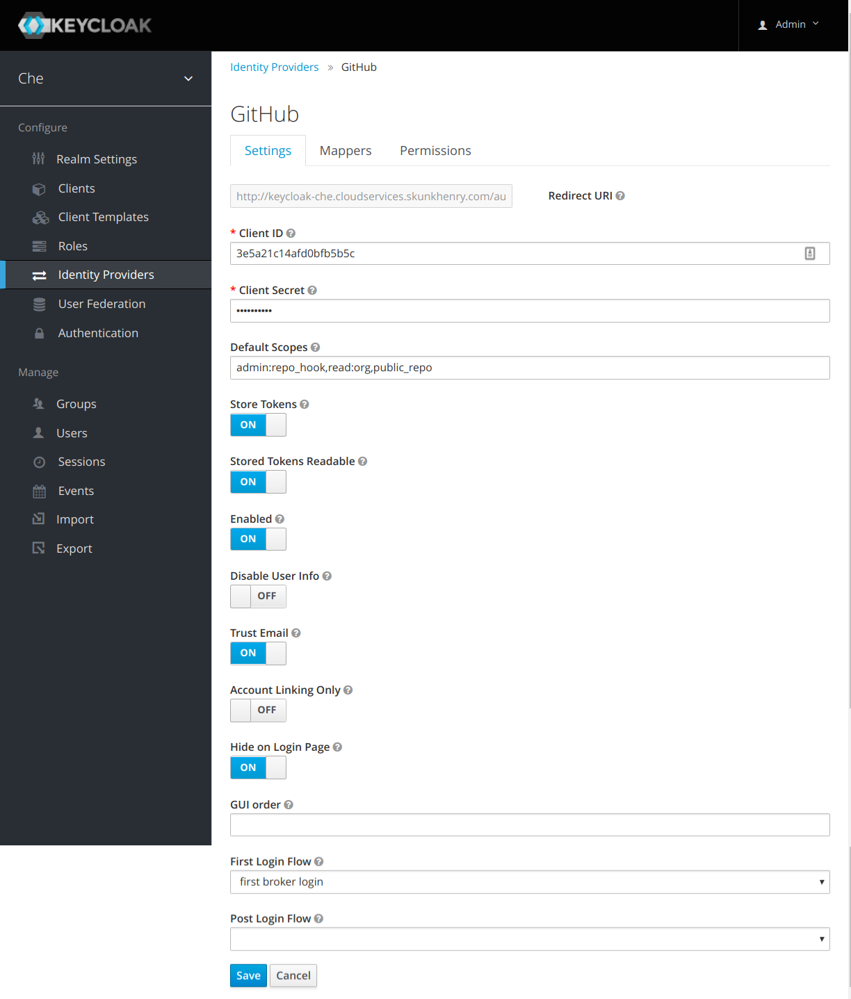

## Guide

* Template based Install https://launcher.fabric8.io/docs/minishift-installation.html#installing-launcher-tool_minishift

## Cluster Admin Requirements

* OAuthClient created in the cluster
* New Client in the OpenShift cluster's Keycloak

## Install Launcher Keycloak

At this time a separate Keycloak is used by Launcher than the Keycloak used by OpenShift.
This is due to integration issues that need to be worked through i.e. how to use a single Keycloak with Launcher for both Authentication (signing into launcher) and OpenShift a/c Authorization (letting launcher create things in users namespace).

Install `Red Hat Single Sign-On 7.2 + PostgreSQL` from the Service Catalog into a new namespace called `launcher`.

* Take note of the exposed Route.
* Get admin credentials using `oc env dc/sso --list|grep SSO_ADMIN`
* Login and create a new realm `launcher`.

## Launcher: Template based Install

Clone the Launcher template:

`git clone git@github.com:fabric8-launcher/launcher-openshift-templates.git`

Login to OpenShift:

`oc login <server>`

Switch to launcher project:

`oc project launcher`

Add the Launcher template:

```
cd launcher-openshift-templates
oc create -f openshift/launcher-template.yaml
```

Create launcher from the template, specifying below parameter:

* `LAUNCHER_KEYCLOAK_URL`
* Note any params that have empty values deliberately

```
oc new-app --template=fabric8-launcher --param=LAUNCHER_MISSIONCONTROL_OPENSHIFT_USERNAME= --param=LAUNCHER_MISSIONCONTROL_OPENSHIFT_PASSWORD= --param=LAUNCHER_MISSIONCONTROL_OPENSHIFT_API_URL= --param=LAUNCHER_MISSIONCONTROL_OPENSHIFT_CONSOLE_URL= --param=LAUNCHER_KEYCLOAK_URL={KEYCLOAK_URL}/auth --param=LAUNCHER_KEYCLOAK_REALM=launcher
```

Take note of the exposed Route for Launcher's frontend for later

```
oc get route launcher
```

TODO. Ansible?

### Create a new Client in **OpenShift's Keycloak** (for Launcher's Keycloak)

* Import from `launcher-openshift-users.json`
* Set the `Root URL` to the URL of Launcher Keycloak
* After creating, set `Valid Redirect URIs`, & `Web Origins` to the same url
* Match any other settings as seen below



### Create a new Client in **Launcher's Keycloak** (for Launcher sign in)

* Import from `launcher-public.json`
* Set the `Root URL` to the URL of Launcher's Frontend/Route
* After creating, set `Valid Redirect URIs`, & `Web Origins` to the same url (Web Origins for root url and `/*`)
* Match any other settings as seen below



### Create a Keycloak Identity Provider in **Launcher's Keycloak** (for authentication/sign in to launcher)

* `Authorization`, `Token` & `Logout URL` set to:
  * `{OPENSHIFT_KEYCLOAK_URL}/auth/realms/{OPENSHIFT_KEYCLOAK_REALM}/protocol/openid-connect/auth`
  * `{OPENSHIFT_KEYCLOAK_URL}/auth/realms/{OPENSHIFT_KEYCLOAK_REALM}/protocol/openid-connect/token`
  * `{OPENSHIFT_KEYCLOAK_URL}/auth/realms/{OPENSHIFT_KEYCLOAK_REALM}/protocol/openid-connect/logout`
* `Client ID` set to `launcher-openshift-users`
* `Client Secret` set to the secret in the `Credentials` tab of the `launcher-openshift-users` Client in OpenShift's Keycloak
* Match any other settings as seen below



* After creating, set this Identity Provider (`keycloak-oidc`) as the default for `Browser` authentication





### Create an OpenShift 3 Identity Provider in **Launcher's Keycloak** (for authorization to create resources in users namespace)

* `Client ID` set to `cloudservices` (must match the cluster `id` in the `launcher-clusters` configmap)
* Set a `Client Secret` (required later)
* `Base Url` set to the OpenShift cluster master url
* `Default Scopes` set to `user:full` (so launcher can create resources on behalf of users)
* Note the `Redirect URI` for later
* Match any other settings as seen below



### Create an OAuthClient in OpenShift

Modify the `redirectURIs` to match the `Redirect URI` field in the `cloudservices` Identity Provider.
Also set ensure the `secret` matches the `Client Secret`.

```
apiVersion: oauth.openshift.io/v1
grantMethod: auto
kind: OAuthClient
metadata:
  name: cloudservices
redirectURIs:
  - https://secure-launcher-sso-launcher.cloudservices.skunkhenry.com/auth/realms/launcher/broker/cloudservices/endpoint
secret: 45e27750-a8aa-11e4-b2ea-3c970e4b7ffe # sample - generate this
```

Run `oc create -f oauthclient.yaml`

### Create a Github Identity provider in **Launcher's Keycloak** (for repo creation)

Create a Github OAuth App (Settings > Org > Developer Settings/OAuthApps), noting the `Client ID` & `Client Secret`. The `Authorization callback URL` of the OAuth App must be set to the `Redirect URI` of the Github Identity Provider in Keycloak e.g. 'https://secure-launcher-sso-launcher.cloudservices.skunkhenry.com/auth/realms/launcher/broker/github/endpoint'

* Copy the `Redirect URI` into the `Authorization callback URL` field in the Github OAuth App
* Set the `Client ID` and `Client Secret` to match whats in the Github OAuth App
* Default scopes of `admin:repo_hook,read:org,public_repo`
* Match any other settings as seen below



## Post-install Configuration

### Launcher Config Map

In the `launcher` config-map, set the below value:

* `launcher.keycloak.client.id` = `launcher-public`

In the `launcher-clusters` config map, replace with the following (using your OpenShift cluster url instead):

```
- id: cloudservices
  name: "Cloud Services Cluster"
  apiUrl: https://mycluster.example.com:8443 
  consoleUrl: https://mycluster.example.com:8443 
  type: pro
```

* Id of `cloudservices` has to match the `openshift-v3` Identity Provider name
* Type of `pro` means all missions are shown (alternative is `starter`)

The launcher-configcontroller watches these configmaps, and redeploys things
Wait for launcher-frontend & launcher-backend to redeploy, then go to the launcher-frontend Route.
You Should be able to:

* login with your OpenShift credentials
* authorize launcher to use your openshift a/c to create resources
* authorize launcher to create repos in your github a/c
* setup a booster, and have it deployed to a namespace automatically, with a git repo for it